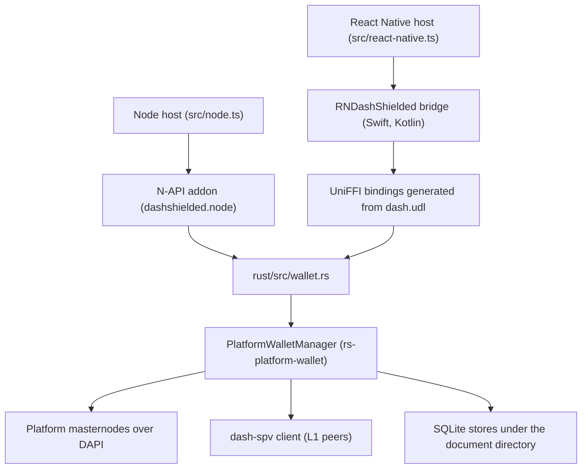
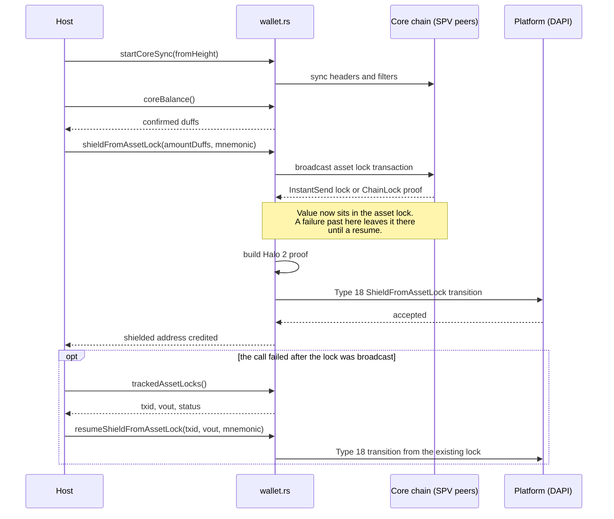
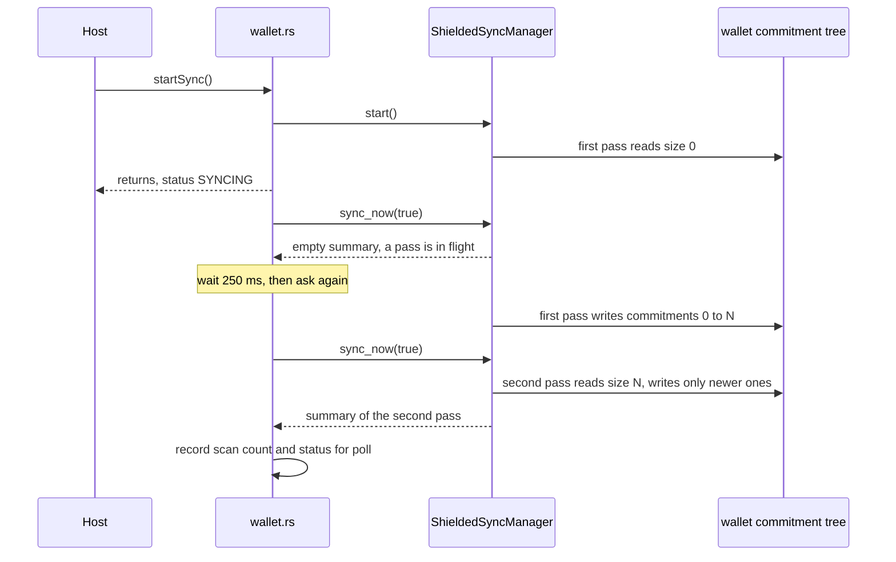

# Dash shielded native module: one Rust wallet for the Platform shielded pool, callable from Node and React Native

| | |
|---|---|
| Status | Implemented (shield, shielded transfer, unshield, withdrawal to [L1](#l1) and resume after a restart verified on testnet from the Node host; a shielded transfer verified from the Edge app on an iOS simulator and an Android emulator; on Android the pinned storage crate refuses to open the wallet store, see [4.3](#43-state-on-disk-and-wallet-open) and [5.7](#57-in-the-edge-app-ios-simulator-and-android-emulator)) |
| Author | Jon Tzeng |
| Reviewer | - |
| Last updated | 2026-10-07 |
| Repos | [dash-shielded-native](https://github.com/EdgeApp/dash-shielded-native) |
| Implementation | [EdgeApp/dash-shielded-native#1](https://github.com/EdgeApp/dash-shielded-native/pull/1) |
| Supersedes | - |
| Related | [Asana task](https://app.asana.com/0/0/1216611553286539/f) |

<!-- tdd-code-fingerprint: 3eedae8f5823a6c747a7577bddaf462aac33a46f -->

File and symbol references point at the `jon/dash-shielded-install-and-smoke` branch, which is stacked on `paul/dashShielded`. The base branch carries the first version of the module by Paul Puey (key derivation, addresses, shielded sync, shielded transfer). This document describes the two branches as one module, and [6. Phase history](#6-phase-history) records which branch added what.

## Contents

1. [Problem](#1-problem)
2. [Prior art](#2-prior-art)
3. [Goals and non-goals](#3-goals-and-non-goals)
4. [Design overview](#4-design-overview)
5. [Testing](#5-testing)
6. [Phase history](#6-phase-history)
7. [Decisions](#7-decisions)
8. [Glossary](#8-glossary)
9. [References](#9-references)
10. [Post-implementation retrospective](#10-post-implementation-retrospective)

## 1. Problem

Edge has no way to hold or move value in the [Dash Platform](#dash-platform) [shielded pool](#shielded-pool). The pool is an [Orchard](#orchard) pool on Dash Platform, and every operation on it needs a [Halo 2](#halo-2) proof built on the device that holds the spend authority. Dash's JavaScript SDK does not build those proofs: the shielded state-transition builder in `@dashevo/wasm-dpp` 4.1.0 is an unimplemented `todo!()`.

An Edge wallet needs four capabilities from one dependency:

- Derive a shielded address and a viewing key from a [BIP-39](#bip-39) mnemonic, on mainnet and testnet.
- Scan the pool for the wallet's notes and report balance, sync status and history.
- Move value in from [L1](#l1), move it inside the pool, and move it back out, either to a transparent Platform address or to an L1 address.
- Run on the targets the Edge app ships: iOS 15.6 on arm64, Android API 28 on `arm64-v8a` and `armeabi-v7a`, plus Node for the currency plugin's tests and scripts.

Value enters the pool in two steps on two chains. The wallet broadcasts an [asset lock](#asset-lock) on L1, waits for proof that the lock is final, then submits a Platform transition that consumes the lock and [credits](#credits) a shielded note. A failure between the steps leaves the [duffs](#duffs) spent into the lock with nothing credited, and a new lock cannot recover them. The module therefore has to list the locks it has built and finish a shield from an existing one.

The mnemonic authorizes every spend. A host process that keeps a wallet open for hours should not keep the mnemonic in that wallet's resident state, where any caller that knows the wallet's alias could use it.

## 2. Prior art

**A [WASM](#wasm-webassembly) prover in the plugin WebView.** The community `pshenmic-dpp` package builds shielded transitions in WASM, and Edge's currency plugins already run in a WebView. Measured on one Apple Silicon host, a shield proof takes 11973 to 12030 ms in WASM against 523 to 576 ms native, about 22 times slower. The package is also a dev-tagged build from a single maintainer that would hold spend keys. See [Decision 1](#decision-1-native-rust-module-over-a-wasm-prover).

**Dash's own mobile SDKs.** `dashpay/platform` ships [packages/swift-sdk](https://github.com/dashpay/platform/tree/v4.2.0-beta.7/packages/swift-sdk) and [packages/kotlin-sdk](https://github.com/dashpay/platform/tree/v4.2.0-beta.7/packages/kotlin-sdk) at tag `v4.2.0-beta.7`. Neither fits Edge's targets:

| | Dash SDK at `v4.2.0-beta.7` | Edge app |
|---|---|---|
| iOS deployment target | `build_ios.sh` defaults to 17.0, `Package.swift` declares iOS 18 | 15.6 |
| Android `minSdk` | 29 | 28 |
| Android ABIs | `arm64-v8a` and `x86_64`; `build_android.sh` excludes `armeabi-v7a` by policy | `arm64-v8a` and `armeabi-v7a` |
| Node target | none | required for plugin tests |

Both SDKs wrap the whole Platform surface (identities, documents, contracts, tokens), of which a shielded wallet uses a small part. See [Decision 4](#decision-4-generate-bindings-from-the-modules-own-udl).

**Edge's native wallet modules.** [react-native-zano](https://github.com/EdgeApp/react-native-zano) and [react-native-monero](https://github.com/EdgeApp/react-native-monero) set the packaging pattern this module follows: a podspec that vendors an [xcframework](#xcframework), an Android library with prebuilt `jniLibs`, a thin TypeScript wrapper, and build scripts in `scripts/`. This module adds a Node addon to that pattern.

**The seed list compiled into `dash-network-seeds`.** The Rust SDK can dial a fixed list of Platform nodes. The list ages with each release, and the module instead asks the network's quorum service for the live set. See [Decision 10](#decision-10-discover-nodes-from-the-quorum-service).

## 3. Goals and non-goals

Goals:

- One Rust crate holds all wallet logic, and both hosts call the same functions.
- Fund the pool from [L1](#l1), transfer inside it, exit to Platform and to L1.
- A shield interrupted after its L1 lock is broadcast can be finished later from the lock's outpoint.
- No function moves funds without the mnemonic passed to that call.
- Native artifacts for the targets listed in [1. Problem](#1-problem), built from scripts in the repo.

Non-goals:

- The Edge currency plugin and GUI that call this module. They are a separate body of work in `edge-currency-accountbased` and `edge-react-gui`.
- Platform features outside the [shielded pool](#shielded-pool): identities, documents, [DPNS](#dpns-dash-platform-name-service), tokens.
- Reopening a wallet without the mnemonic. `initialize` always receives it; see [Decision 7](#decision-7-attest-the-viewing-key-capability-in-a-wrapper).
- `x86_64` slices for Android emulators and Intel iOS simulators. The Edge app's `abiFilters` excludes Intel.
- Cross-compiled Node prebuilds. A Node prebuild is produced on, and for, the build host.
- Tuning proving time on phones. No phone has run a proof yet; see [6.4 Deferred work](#64-deferred-work).

## 4. Design overview

The module is one repo. A single Rust file, `rust/src/wallet.rs`, owns wallet state and every operation. Two thin backends export it: [N-API](#n-api) for Node and [UniFFI](#uniffi) for iOS and Android. TypeScript wrappers on each host present the same `Synchronizer` object.

### 4.1 Layers and bindings



The crate `edge-dash-shielded` builds a library named `dashshielded` as both `cdylib` and `staticlib`. A Cargo feature selects the backend: `napi-backend` (the default) compiles `rust/src/napi_api.rs`, and `uniffi-backend` compiles `rust/src/uniffi_api.rs` against the interface in `rust/src/dash.udl`. Both files are pass-through shims: they convert argument and error types and call `wallet.rs`.

UniFFI generates `ios/dash.swift` and `android/src/main/java/uniffi/dash/dash.kt` from the [UDL](#udl-uniffi-definition-language). The hand-written bridges (`ios/RNDashShielded.swift` with its `RNDashShielded.m` export table, and `RNDashShieldedModule.kt`) expose 22 methods to React Native and forward each to the generated bindings.

On Node, `src/load-addon.ts` walks up to six parent directories from its own location looking for `prebuilds/<platform>-<arch>/dashshielded.node`, then for a development build under `rust/target/release`. It throws an error that names `npm run build-native-host` when none exists.

Dependency versions are pinned to fixed refs:

| Dependency | Ref |
|---|---|
| `dash-sdk`, `platform-wallet`, `platform-wallet-storage`, `rs-sdk-trusted-context-provider` | `dashpay/platform` tag `v4.2.0-beta.7` |
| `dashcore`, `key-wallet`, `dash-spv`, `dash-network-seeds` | `dashpay/rust-dashcore` rev `e4208c90` |
| [`orchard`](#orchard) | `dashpay/orchard` tag `dashified-0.14.1` |
| Rust toolchain | 1.98.1, in `rust/rust-toolchain.toml` |

The Platform tag is a beta. The released `v4.1.1` cannot restore a wallet from its store, and [Decision 11](#decision-11-pin-the-42-beta-over-the-released-411) records the trade.

### 4.2 Endpoint discovery

`initialize` asks the network's quorum service (`quorums.mainnet.networks.dash.org` or `quorums.testnet.networks.dash.org`) for the current masternode list and builds the SDK's address list from it. The caller's `defaultHost` and `defaultPort` are a fallback for when discovery returns nothing, and the only source on a devnet, which has no quorum service. With neither, `initialize` fails with `no DAPI endpoints`.

Platform gRPC listens on a different port per network, and the port comes from the network unless the caller names one:

[`rust/src/wallet.rs`](https://github.com/EdgeApp/dash-shielded-native/blob/198c1cc20275aba140322bbd2dc65532b8555d33/rust/src/wallet.rs)
```rust
fn platform_port(network: Network, caller_port: u32) -> u32 {
    if caller_port != 0 {
        return caller_port;
    }
    match network {
        Network::Mainnet => 443,
        _ => 1443,
    }
}
```

Every discovered node is dialed over `https`, whatever port it answers on. The scheme is inferred from the port only for the caller's own fallback host, where a local deployment without TLS is a legitimate target:

[`rust/src/wallet.rs`](https://github.com/EdgeApp/dash-shielded-native/blob/198c1cc20275aba140322bbd2dc65532b8555d33/rust/src/wallet.rs)
```rust
fn platform_scheme(port: u32) -> &'static str {
    if port == 443 || port == 1443 {
        "https"
    } else {
        "http"
    }
}
```

See [Decision 2](#decision-2-https-for-every-discovered-node) and [Decision 3](#decision-3-port-from-the-network-when-the-caller-passes-0).

Proofs returned by Platform are verified against quorum public keys from a `TrustedHttpContextProvider` with a 100-entry cache. The provider is compiled with its `withdrawals-contract` feature. Verifying the proof of a shielded withdrawal reads the withdrawals system contract, and the provider serves that contract only with the feature on.

### 4.3 State on disk and wallet open

`setDocumentDirectory` names a root, and each wallet alias gets `<root>/dash-shielded/<alias>/` containing:

| Path | Owner | Contents |
|---|---|---|
| `wallet.db` | `SqlitePersister` (`platform-wallet-storage`) | Core wallet state, Platform addresses, asset-lock rows |
| `shielded.db` | the shielded coordinator's store | notes, the commitment tree and its checkpoints, activity |
| [`spv](#spv-simplified-payment-verification)/` | `dash-spv` | headers and compact filters for [L1](#l1) |

`initialize` opens a wallet in this order:

1. Build the SDK and a `PlatformWalletManager` over the persister.
2. Call `load_from_persistor`, then reuse the restored wallet if the store held one. Failure is not fatal and is logged only when `DASH_SHIELDED_DEBUG` is set.
3. On a store with no wallet, create it from the 64-byte [BIP-39](#bip-39) seed.
4. Derive the Orchard keys under [ZIP-32](#zip-32) (coin type 5 on mainnet, 1 on testnet) and bind them to the coordinator with `bind_shielded`.

On a populated store, step 2 restores the wallet with its Core balance, its address pool and its tracked asset locks. A second process on the same store reports the L1 balance before its SPV client has synced a block, and it lists the locks an earlier process broadcast. [4.5 Funding from L1](#45-funding-from-l1) covers what that listing means. See [Decision 6](#decision-6-load-from-the-persister-before-creating).

The restored address pool remembers which receive addresses were handed out. `coreReceiveAddress` returned `yffmKKHNbN9Sm7anAJpRg8mW7EJiD2n3DR` on a new store and the next unused address, `yefKbrX5PEZAuY9kt6td6EGMBH5K6J1fqs`, on the same store reopened. A host that checks a phrase by comparing the first receive address against a known value has to do it on a new store. The shielded address is derived from the seed alone and is the same on both.

At `v4.2.0-beta.7`, `SqlitePersister::open` inspects the directory that will hold `wallet.db` before it creates the file. `check_parent_perms` (`rs-platform-wallet-storage/src/parent_permissions.rs`) walks that directory and every ancestor up to `/`, once along the path as given and once along its canonical form. It refuses the open when a directory is group- or other-writable without the sticky bit, or when its owner is neither the process's user, uid 0, nor the owner of `/`. The check runs on every Unix target, `SqlitePersisterConfig` has no field that turns it off, and `open` is the only constructor. The file is absent at `v4.1.1` and unchanged at `v5.0.0-beta.2`.

Two hosts fail the check as they ship ([5.7](#57-in-the-edge-app-ios-simulator-and-android-emulator)):

| Host | Directory refused | Reason |
|---|---|---|
| Android 16 emulator | the app's `files` directory | mode 0771 |
| Android 16 emulator, `files` set to 0700 | `/data` | mode 0771 |
| Android 16 emulator, `/data` set to 0751 by root | `/data` | owned by uid 1000 (`system`) |
| iOS 18.6 simulator | the simulator device's `data` directory on the Mac | mode 0775 |

An app can tighten its own directories. It cannot change `/data`, which Android's init creates as `system:system` with mode 0771, and every path an app can write lies below it. On Android `initialize` therefore fails with `open wallet store: database ancestor /data is group/other-writable (mode 0771) and not sticky`, and no wallet opens. The module has no way around it short of a patched storage crate. See [Decision 11](#decision-11-pin-the-42-beta-over-the-released-411) and [6.4 Deferred work](#64-deferred-work). The iOS simulator failure belongs to the Mac's directory layout, and whether an iOS device passes has not been observed.

`bind_shielded` requires a persister that attests the `SHIELDED_VIEWING_KEYS` capability. The stock `SqlitePersister` attests it only when `platform-wallet-storage` is compiled with its `shielded` feature, which this crate does not enable. A wrapper adds it:

[`rust/src/wallet.rs`](https://github.com/EdgeApp/dash-shielded-native/blob/198c1cc20275aba140322bbd2dc65532b8555d33/rust/src/wallet.rs)
```rust
struct ShieldedCapablePersister {
    inner: SqlitePersister,
}
```

[`rust/src/wallet.rs`](https://github.com/EdgeApp/dash-shielded-native/blob/198c1cc20275aba140322bbd2dc65532b8555d33/rust/src/wallet.rs)
```rust
    fn persistence_capabilities(&self) -> PersistenceCapabilities {
        self.inner
            .persistence_capabilities()
            .union(PersistenceCapabilities::SHIELDED_VIEWING_KEYS)
    }
```

Open wallets live in a process-wide map from alias to `ClientSlot`, behind one async mutex. A slot holds the manager, the wallet handle, the network, the account index, cached status and pending transfer proposals. It holds no mnemonic.

`stop` removes the slot first, then stops the shielded sync loop, awaits its `quiesce`, and shuts the manager down. Dropping the manager while the sync task still owns a timer panics that task, so the order matters.

### 4.4 API surface

The same calls exist on both hosts. Names below are the TypeScript ones; the Rust and UDL names are the snake-case equivalents.

| Group | Call | Needs mnemonic | Result |
|---|---|---|---|
| Tools | `generateMnemonic`, `deriveViewingKey`, `deriveShieldedAddress`, `isValidAddress` | derivation only | 24-word phrase, viewing key, [Bech32m](#bech32m) address |
| Tools | `warmUpProver`, `isProverReady` | no | builds the [Halo 2](#halo-2) proving key once per process |
| Lifecycle | `initialize`, `stop` | `initialize` | opens or closes the wallet for an alias |
| Shielded sync | `startSync`, `stopSync`, `poll` | no | status, scan progress, balance in [credits](#credits), up to 500 activity rows |
| L1 | `coreReceiveAddress`, `startCoreSync`, `coreBalance` | no | [BIP-44](#bip-44) address, SPV sync from a start height, balance in [duffs](#duffs) |
| Platform | `platformReceiveAddress` | no | transparent Platform address under [DIP-17](#dip-17) |
| Fund | `shieldFromAssetLock`, `trackedAssetLocks`, `resumeShieldFromAssetLock` | shield and resume | the credited shielded address; `{ txid, vout, status }` per lock |
| Transfer | `proposeTransfer`, `createTransfer` | `createTransfer` | `{ proposalId, feeCredits }`, then `{ txid }` |
| Exit | `unshield`, `shieldedWithdraw` | yes | the destination address |

Amounts cross the boundary as decimal strings. L1 amounts are in duffs and pool amounts are in credits, at 1000 credits per duff. `proposeTransfer` validates the recipient's network, the memo length (32 UTF-8 bytes at most) and the balance before returning a fee, so a caller never shows a fee for a transfer that cannot be built.

A shielded address is Bech32m with the prefix `dash` or `tdash`, carrying a type byte `0x10` and the 43-byte raw Orchard address.

Each host wraps these calls in a `Synchronizer` that polls and emits `onBalanceChanged`, `onStatusChanged`, `onTransactionsChanged`, `onUpdate` and `onError`. The React Native wrapper polls every 500 ms while the status is `SYNCING` and every 2000 ms otherwise.

### 4.5 Funding from L1



The Platform SDK connection cannot see L1. `startCoreSync` starts the `dash-spv` client the manager holds, storing its data under `spv/`, and `fromHeight` skips history a new wallet cannot own. Calling it again while the client runs is a no-op.

`shieldFromAssetLock` passes `AssetLockFunding::FromWalletBalance { amount_duffs, account_index }` to the upstream orchestrator, which builds the lock, waits for its proof, proves the Type 18 transition and pays the wallet's own Orchard address. `resumeShieldFromAssetLock` passes `AssetLockFunding::FromExistingAssetLock { out_point, consume_invitation_voucher: false }` and skips the L1 half.

`trackedAssetLocks` is what makes resume usable. A failing shield returns an error, not the outpoint it had just broadcast, and the listing is the only way a host learns it. Each lock reports one status: `built`, `broadcast`, `instant_send_locked`, `chain_locked`, `consumed` or `recovered_from_chain`.

The first five are stages a lock passes through inside the process that built it. `recovered_from_chain` is what a lock reads after [wallet open](#43-state-on-disk-and-wallet-open) rebuilds it in a later process from the wallet's chain records. Core has finalized such a lock, and the wallet cannot tell locally whether Platform consumed it. A lock this store saw consumed is left out of the rebuild. A lock consumed through some other store is rebuilt, and it reads `recovered_from_chain` like a stranded one.

Resuming is how a host tells the two apart. A stranded lock shields and reads `consumed` for the rest of that process. A lock Platform already consumed fails, moves no value and keeps its status, so a host cannot clear spent locks from the list. In that second case upstream tries to record the lock as consumption-unknown. That write requires the `wallet_restore` persistence capability, which `SqlitePersister` does not attest because its restore has no readers for token balances or the DashPay overlay. The host therefore receives `Failed to persist state: asset-lock reconciliation requires persistence capabilities ["wallet_restore"]` in place of upstream's typed `AssetLockAlreadyConsumed`. [6.4 Deferred work](#64-deferred-work) lists this.

### 4.6 Seed handling

The wallet is created external-signable: `PlatformWallet` holds public key material and no private keys. Every call that moves funds takes the mnemonic as a parameter and derives what it needs for that call:

- `createTransfer`, `unshield` and `shieldedWithdraw` derive the 64-byte seed and hand it to the upstream spend function, which derives the Orchard spend authority.
- `shieldFromAssetLock` and `resumeShieldFromAssetLock` build a `SeedSigner`, which signs the L1 inputs and the credit-output key binding.

[`rust/src/wallet.rs`](https://github.com/EdgeApp/dash-shielded-native/blob/198c1cc20275aba140322bbd2dc65532b8555d33/rust/src/wallet.rs)
```rust
struct SeedSigner {
    wallet: key_wallet::wallet::Wallet,
}

impl SeedSigner {
    fn new(seed: [u8; 64], network: Network) -> WalletResult<Self> {
        Ok(Self {
            wallet: key_wallet::wallet::Wallet::from_seed_bytes(
                seed,
                network,
                WalletAccountCreationOptions::None,
            )
            .map_err(|e| format!("seed wallet: {e}"))?,
        })
    }
}
```

`SeedSigner` signs any derivation path the orchestrator asks for, so it reaches the transparent L1 balance as well as the lock. That reach is why it is built per call and dropped when the call returns. See [Decision 5](#decision-5-the-mnemonic-is-a-per-call-parameter).

Read-only calls (`poll`, the receive-address calls, `coreBalance`, `trackedAssetLocks`) need only the alias.

### 4.7 Sync passes, anchors and spends

`createTransfer`, `unshield` and `shieldedWithdraw` all end in upstream's `extract_spends_and_anchor`. Platform accepts a spend only if its [anchor](#anchor) is a commitment-tree root Platform recorded, and it records one anchor per block. The function fetches the recorded set, then probes the wallet's tree for the shallowest checkpoint whose root is in that set: depth 0 first, then depths 1 to 99 (`MAX_ANCHOR_PROBE_DEPTH = 100`, matching the tree's checkpoint retention). When none matches it returns `ShieldedNoRecordedAnchor` with the text `no recorded anchor covers the selected notes; wait for the next shielded sync`, and nothing is broadcast. The module passes this error through unchanged.

A root in the wallet's tree can match one of Platform's only if the tree holds the same commitments in the same positions, which means every sync pass has to append each commitment once. Upstream's pass does not guarantee that by itself. It reads the tree size under a read lock, fetches the commitments past that size, and takes the write lock only to append them (`wallet/shielded/sync.rs`). Two passes that overlap both read the old size and both append the full range, and the tree ends up with every commitment twice.

`ShieldedSyncManager::sync_now` prevents the overlap: it holds an in-flight flag for the whole pass and returns an empty summary when another pass holds it. The coordinator's own `sync` method has no such guard. `startSync` needs two things from upstream, the periodic loop (one pass every 60 seconds until `stopSync`) and one immediate forced pass whose summary it records so that `poll` reports a scan count and a `SYNCED` or `ERROR` status. The loop's first pass starts at once and returns its summary to nobody the module can read. The module therefore sends its own pass through the manager and waits out a pass already in flight:

[`rust/src/wallet.rs`](https://github.com/EdgeApp/dash-shielded-native/blob/198c1cc20275aba140322bbd2dc65532b8555d33/rust/src/wallet.rs)
```rust
            let sync = manager.shielded_sync_arc();
            let summary = loop {
                let summary = sync.sync_now(true).await;
                // An empty summary means the pass was skipped because one
                // was already in flight. Wait it out, then run ours.
                if !summary.is_empty() || !sync.is_running() {
                    break summary;
                }
                tokio::time::sleep(std::time::Duration::from_millis(250)).await;
            };
            if summary.is_empty() {
                // Stopped before any pass of ours ran: nothing to record.
                return;
            }
```



The forced flag matters for the second pass. The loop passes `false`, which lets a wallet that caught up less than 30 seconds ago skip the round trip to Platform. A host that just called `startSync` wants a pass that checks Platform regardless. An empty summary with the loop no longer running means `stopSync` arrived first, and the task records nothing. See [Decision 12](#decision-12-run-the-immediate-sync-pass-through-the-sync-manager).

`shieldedWithdraw` has a step the other two spends lack. After Platform accepts the transition, upstream verifies the execution proof, and that verification reads the withdrawals system contract from the context provider ([4.2](#42-endpoint-discovery)). When the provider cannot serve the contract, the withdrawal has already landed and the call still returns an error that begins `Shielded withdraw was submitted but its execution result could not be confirmed`. The rest of the text tells the host not to resubmit. With the feature on, the call returns the destination address.

`createTransfer` has one more step. The upstream transfer call returns nothing, and the transaction id exists only as a row in the store's activity log. The module snapshots the activity ids before the spend and polls for a new outgoing row, 40 times at 250 ms, then returns its id as `txid`. If no row appears it returns an error that says the transfer was submitted, since the spend itself was accepted.

`shieldedWithdraw` takes a `coreFeePerByte` rate that prices the L1 transaction Platform builds on the far side.

### 4.8 Native artifacts and build

| Artifact | Script | Targets | Size |
|---|---|---|---|
| `prebuilds/<platform>-<arch>/dashshielded.node` | `build-native-host.ts` | the build host | - |
| `ios/libdashshielded.xcframework` | `build-native-ios.ts` | `ios-arm64`, `ios-arm64-simulator`, deployment target 15.6 | 36.9 MB per slice |
| `android/src/main/jniLibs/<abi>/libdashshielded.so` | `build-native-android.ts` | `arm64-v8a`, `armeabi-v7a`, [NDK](#ndk-native-development-kit) 27.1.12297006 | 15.7 MB and 12.4 MB, stripped |

The Android script builds through `cargo ndk` and passes linker arguments for 16 KB page alignment. `android/build.gradle` packages both ABIs (`abiFilters 'armeabi-v7a', 'arm64-v8a'`). The host script copies the built library into `prebuilds/` and re-signs it ad hoc: a copied Mach-O keeps its linker-generated signature, macOS rejects that signature on load, and `require()` of the unsigned copy is killed with `SIGKILL` and no message.

The release profile optimizes for size, because the iOS app links every native module into one binary:

[`rust/Cargo.toml`](https://github.com/EdgeApp/dash-shielded-native/blob/198c1cc20275aba140322bbd2dc65532b8555d33/rust/Cargo.toml)
```toml
[profile.release]
opt-level = "z"
lto = "fat"
codegen-units = 1
strip = true
# Deliberately NOT `panic = "abort"`: both backends turn a Rust panic into a
# host-side error, and aborting would take the whole app down instead.
```

See [Decision 8](#decision-8-size-optimized-release-profile-with-unwinding-panics).

Build prerequisites beyond Rust: `protoc` on the path (`dash-sdk` compiles protobuf definitions during the cargo build), and every cross target installed on the pinned 1.98.1 toolchain. A target installed only on the default stable toolchain fails with `E0463: can't find crate for std`.

## 5. Testing

Every run below is against live Dash testnet. [5.1](#51-host-build-and-smoke-test) to [5.6](#56-unshield-withdrawal-and-repeated-spends) ran on the Node host on macOS arm64. [5.7](#57-in-the-edge-app-ios-simulator-and-android-emulator) ran the mobile artifacts inside the Edge app on an iOS simulator and an Android emulator. No run used a physical phone.

### 5.1 Host build and smoke test

| Step | Result |
|---|---|
| `socket npm install` | 638 packages resolve |
| `socket npm run lint` | no findings |
| `socket npm run prepare` (rollup, then tsc) | passes |
| `socket npm run build-native-host` | produces the signed addon; `codesign -dv` reports `adhoc` |
| `socket npm run smoke-node` | prints `smoke-node ok` with a derived testnet address and the viewing key; `proverMs` 1350 to 1464 |

The smoke test warms the [Halo 2](#halo-2) proving key and asserts that `isProverReady` flips. Deleting `prebuilds/darwin-arm64/`, rebuilding and re-running reproduces the pass from a clean state.

### 5.2 Fund and shield

`scripts/fund-testnet.ts` prints the [L1](#l1) address, starts the Core sync, waits for a balance, shields and reports the pool balance.

```
fund this L1 address: yffmKKHNbN9Sm7anAJpRg8mW7EJiD2n3DR
L1 height 1550616 confirmed 89999703 unconfirmed 0
shielding 10000000 duffs
shielded to tdash1zryn7dw2rhsjxv628awvgxfmw4jh0ytpdgz9rrl2ff38mclgdtm3p936uh2h8zg4gw3c08gqsancf in 4151 ms
shielded balance 9787148800 credits
```

The 10000000 [duffs](#duffs) are 10000000000 [credits](#credits), so the shield cost 212851200 credits. The Core sync reached testnet tip from a start height about 1100 blocks back in roughly a minute.

### 5.3 Shielded transfer

```
status SYNCED available 9787148800 total 9787148800
proposal {"proposalId":"p-1","feeCredits":"162851200"}
TRANSFER_RESULT {"txid":"fd960262bb68bed1ba1a49bdba394de1a0209ad2e0fc93210a894c22140e291e","amountCredits":"1000000000","feeCredits":"162851200"} in 4225 ms
```

A second transfer on a later store landed as `4f7f10de7da3e818d4507e1ee63d5f84749803856e45997fa5dd17e39ddd329b` in 4132 ms.

### 5.4 Seed gate, lock listing and resume

Calling `unshield` on an open wallet with a wrong phrase is refused with `invalid mnemonic: BIP-0039 mnemonic only supports 12/15/18/21/24 words` before any note is selected.

Lock listing and resume, in one process:

```
LOCKS_BEFORE []
L1 height 1550770 confirmed 79999406
SHIELD ok tdash1zryn7dw2rhsjxv628awvgxfmw4jh0ytpdgz9rrl2ff38mclgdtm3p936uh2h8zg4gw3c08gqsancf in 4466 ms
LOCKS_AFTER [{"txid":"ce79317247b018827f2cc0e8be41781b8641ac6d1258ae2d7f9663c47d18a9e8","vout":0,"status":"consumed"}]
RESUME_ERR ce79317247b018827f2cc0e8be41781b8641ac6d1258ae2d7f9663c47d18a9e8:0 Asset lock ce79317247b018827f2cc0e8be41781b8641ac6d1258ae2d7f9663c47d18a9e8:0 has already been consumed
```

That run was on `v4.1.1`, where a new process restored nothing, which is why `LOCKS_BEFORE` is empty. The resume of a lock this process built returns `AssetLockAlreadyConsumed`: the lookup found the lock, and upstream refused to spend it twice.

Resume after a restart. The first shield this module ever attempted broadcast the lock `c12094b3…:0` and then failed on the port ([6.2](#62-install-fix-funding-exits-and-artifacts)), and the process that built it exited. On `v4.2.0-beta.7`, a second process on a store that had synced the wallet's L1 history listed that lock and finished the shield:

```
CORE h=1567749 confirmed=78999109 unconfirmed=1000000 total=79999109
LOCKS [{"txid":"332e9956e19c7c43986c936237119aab0b74cc76caee00f78400136dcf214f6f","vout":0,"status":"unknown"},{"txid":"ce79317247b018827f2cc0e8be41781b8641ac6d1258ae2d7f9663c47d18a9e8","vout":0,"status":"unknown"},{"txid":"c12094b34f3ecb86d3670ddcb1a0d6b00a6b711838e5ebc5e25d66f53eef52f8","vout":0,"status":"unknown"}]
RESUME-OK tdash1zryn7dw2rhsjxv628awvgxfmw4jh0ytpdgz9rrl2ff38mclgdtm3p936uh2h8zg4gw3c08gqsancf
LOCKS [{"txid":"332e9956e19c7c43986c936237119aab0b74cc76caee00f78400136dcf214f6f","vout":0,"status":"unknown"},{"txid":"ce79317247b018827f2cc0e8be41781b8641ac6d1258ae2d7f9663c47d18a9e8","vout":0,"status":"unknown"},{"txid":"c12094b34f3ecb86d3670ddcb1a0d6b00a6b711838e5ebc5e25d66f53eef52f8","vout":0,"status":"consumed"}]
```

- The `CORE` line is printed at open, before the [SPV](#spv-simplified-payment-verification) client has synced a block. The balance came from the store.
- The resume returned 4.4 seconds after the listing. A later sync on a new store showed 14821200800 credits, up from 5034052000 by 9787148800: the lock's 10000000000 less a 212851200 fee.
- The statuses read `unknown` because that build predates the module's name for upstream's `RecoveredFromChain`. The next block is the same store on the PR build.

The same test on `v4.1.1`, with a second process on its own synced store, has nothing to resume:

```
CORE h=1567742 confirmed=0 unconfirmed=0 total=0
CORE h=1567749 confirmed=79999109 unconfirmed=0 total=79999109
LOCKS []
RESUME-ERR resume shield from asset lock failed: Asset lock c12094b34f3ecb86d3670ddcb1a0d6b00a6b711838e5ebc5e25d66f53eef52f8:0 is not tracked by this wallet
```

A third process on the `v4.2.0-beta.7` store, running the PR build, shows what a reopened wallet lists and what resuming a spent lock returns:

```
LOCKS [{"txid":"332e9956e19c7c43986c936237119aab0b74cc76caee00f78400136dcf214f6f","vout":0,"status":"recovered_from_chain"},{"txid":"ce79317247b018827f2cc0e8be41781b8641ac6d1258ae2d7f9663c47d18a9e8","vout":0,"status":"recovered_from_chain"}]
RESUME-ERR resume shield from asset lock failed: Failed to persist state: asset-lock reconciliation requires persistence capabilities ["wallet_restore"] (missing mask 0x80)
LOCKS [{"txid":"332e9956e19c7c43986c936237119aab0b74cc76caee00f78400136dcf214f6f","vout":0,"status":"recovered_from_chain"},{"txid":"ce79317247b018827f2cc0e8be41781b8641ac6d1258ae2d7f9663c47d18a9e8","vout":0,"status":"recovered_from_chain"}]
```

- `c12094b3…:0` is no longer listed. This store saw it consumed in the second process.
- The two listed locks were consumed weeks earlier through stores that no longer exist. The resume targeted `ce793172…:0`, returned in 2.1 seconds, and left the listing unchanged. [4.5](#45-funding-from-l1) explains the error text.

### 5.5 Native artifacts: symbols and APK size

Every symbol the generated bindings load was diffed against what each library exports.

| Bindings | Symbols referenced | Library | Symbols exported | Missing |
|---|---|---|---|---|
| Kotlin (`dash.kt`) | 103 | `arm64-v8a`, `armeabi-v7a` | 103 each | 0 |
| Swift (`dash.swift`) | 49 | `ios-arm64`, `ios-arm64-simulator` | 103 each | 0 |

The counts were taken on the libraries built at `v4.2.0-beta.7`, and the `ios-arm64` slice carries `minos 15.6`. This check catches a library-name mismatch or a codegen gap on one [ABI](#abi-application-binary-interface), which would otherwise appear on a device as an `UnsatisfiedLinkError` or an undefined symbol at link time. The `arm64-v8a` and `ios-arm64-simulator` libraries were also loaded and run ([5.7](#57-in-the-edge-app-ios-simulator-and-android-emulator)). The symbol diff is the only check `armeabi-v7a` and `ios-arm64` have had beyond being packaged. See [Decision 9](#decision-9-static-symbol-diff-for-the-slices-no-test-host-loads).

Edge cannot ship an app bundle, so it ships one APK per ABI, and Google Play caps an APK at 100 MB. A release build of `edge-react-gui` (`develop` at `982bc31ee`) with the module linked from the PR head, `./gradlew assembleRelease -PabiSplits`, produced these files. One MB is 1000000 bytes here, the tighter reading of the cap.

| APK | Size in bytes | Size | Room under 100 MB |
|---|---|---|---|
| `app-arm64-v8a-release.apk` | 91700971 | 91.7 MB | 8.3 MB |
| `app-armeabi-v7a-release.apk` | 87580319 | 87.6 MB | 12.4 MB |
| `app-universal-release.apk` | 128855272 | 128.9 MB | over by 28.9 MB |

What the module adds to each split, read from the APK's own entries:

| Split | `libdashshielded.so` | Compressed in the APK | [JNA](#jna-java-native-access) `libjnidispatch.so` | Compressed in the APK |
|---|---|---|---|---|
| `arm64-v8a` | 15743776 | 8539456 | 165992 | 40195 |
| `armeabi-v7a` | 12399948 | 7696734 | 116344 | 42075 |

[UniFFI](#uniffi)'s Kotlin bindings call the library through JNA, so the app also gains JNA's native library and its classes. The module costs each split about 8 MB, and the larger split keeps 8.3 MB of room for everything else Edge adds before it reaches the cap.

### 5.6 Unshield, withdrawal and repeated spends

Each row below is one spend from a store opened new and synced to tip. Wallet tree size and Platform's notes count were read just before the attempt. The readings come from scratch builds that add a diagnostics call, which the PR does not carry.

With the two overlapping first passes ([4.7](#47-sync-passes-anchors-and-spends)), the wallet's tree is twice Platform's:

| Pin | Spend | Wallet tree size | Platform notes | Outcome |
|---|---|---|---|---|
| `v4.1.1` | withdraw 1000000000 | 9506 | 4753 | accepted, `97eab26b898f5e25e04969cbd0e2b04ef07b483ca9eedb1a53b57ae118d74e75`; the call returned the unconfirmed-result error |
| `v4.1.1` | unshield 500000000 | 9506 | 4755 | `no recorded anchor covers the selected notes` |
| `v4.2.0-beta.7` | withdraw 1000000000 | 9530 | 4765 | accepted, `17801e42b676d1534ca122cdd10a32e5b7be9cf71fd03fa4982e1737b52d9241`; the call returned the unconfirmed-result error |
| `v4.2.0-beta.7` | unshield 500000000 | 9530 | 4767 | accepted, `e5c5204a2f7a064572aef763da610c87cdf735eec70e198334e4729e26305626` |
| `v4.2.0-beta.7` | unshield 500000000 | 9530 | 4769 | `no recorded anchor covers the selected notes` |

In every row the wallet's depth-0 root was not one Platform had recorded. The spends that landed used the depth-1 checkpoint, taken after one pass had appended and before the other did, whose root Platform still recognized. The doubled tree is larger than Platform's count, so later passes fetch nothing and the size never moves: the tree stops gaining commitments, the wallet's own change notes among them. This is the sequence the earlier testnet drives hit, with one transfer accepted and every spend after it failing. An earlier version of this document placed the cause upstream; see item 7 of [10.2](#102-where-this-document-was-wrong-or-silent).

With the immediate pass routed through the sync manager, the wallet's size equals Platform's notes count and the wallet's depth-0 root equals Platform's most recent [anchor](#anchor) before every spend. Roots are shown by their first 16 hex digits.

| Pin | Spend | Tree size and notes | Root and anchor | Outcome |
|---|---|---|---|---|
| `v4.1.1` | withdraw 1000000000 | 4755 | `a62723dc6fc9fedc` | accepted, `d58c71461c5abceec044b6c207e62e8b8ca5509d818c99cb91e566f77fba1f67`; unconfirmed-result error |
| `v4.1.1` | unshield 500000000 | 4757 | `a09821168cdc6efd` | accepted, `715c69f1bd982347b09038948f21495678b6a791ce2c33e211792fd81ed47b7a` |
| `v4.1.1` | transfer 300000000 | 4759 | `d431079716570cc9` | accepted, `0b0ddc433f70f9b3fbc458984b2081f4e2bdb9c85c33c055669ea964179396c6` |
| `v4.1.1` | unshield 500000000 | 4761 | `3534052d644fce87` | accepted, `dcf263e970be7720ad9a7fdf5e5aea5df155c693430e3c364cada377f1a3b3cf` |
| `v4.1.1` | withdraw 1000000000 | 4763 | `236730b25e7470db` | accepted, `8d08a327db193fee2e3fbd7b6320b667dd4ef4193c98e4191ea4955e8d63c34f`; unconfirmed-result error |
| `v4.2.0-beta.7`, withdrawals feature on | withdraw 1000000000 | 4769 | `ae78a13bcc7ff203` | accepted, `d41b6353b93e6e338d29b4656ce5b7b6f546c1b429a22d4698f974397dc66182`; returned the address in 3.5 s |
| `v4.2.0-beta.7`, withdrawals feature on | unshield 500000000 | 4771 | `932286347b45533b` | accepted, `5abb7a4425728b05b4ff7f80161cdfb9f8354ee5d82ad6c92d9f363bae1e0f4c` |

The `v4.1.1` rows ran without the `withdrawals-contract` feature. Both withdrawals landed on chain while the call returned an error, the first naming the missing contract and the second a gRPC timeout. With the feature on, the withdrawal returns its destination.

The PR build, on its own new store, in one process:

| Spend | Outcome | Time | Pool balance after |
|---|---|---|---|
| withdraw 1000000000 to `yffmKKHNbN9Sm7anAJpRg8mW7EJiD2n3DR` | accepted, `9a862caf4a7f0d008946b5f003e55eeda0cf628d5cb9a5514706f89adb522dad` | 3278 ms | 13546009600 |
| unshield 500000000 to `tdash1krxraw6u2wczgp956t7mpn2pg05l2uzxk57hdvlx` | accepted, `4cc80a45c8e2945af5b5e8c6a7dd5b77efc9c485e66bfaf780da27930da094a3` | 3535 ms | 12877075600 |
| transfer 300000000, fee 114140000 | accepted, `b440f3ded5238f38f08765ae916771aee9478f914e9ba0126f4e586ff88bcc48` | 3625 ms | 12714224400 |

The pool held 14821200800 credits before the first of these. The withdrawal arrived on L1: the wallet's Core balance rose from 79999109 to 80999109 duffs.

### 5.7 In the Edge app: iOS simulator and Android emulator

`edge-react-gui` (`develop` at `982bc31ee`) was built with the module added as a `file:` dependency on the PR head, plus a local test script that runs at app start. Neither change is committed anywhere. The script warms the prover, opens a new store from the test wallet's phrase on testnet, checks the shielded address, syncs, and sends 300000000 [credits](#credits) to the wallet's own shielded address through `proposeTransfer` and `createTransfer`.

| Host | Store open | Prover warm-up | First sync | Transfer |
|---|---|---|---|---|
| iOS 18.6 simulator, as booted | refused: `database ancestor …/CoreSimulator/Devices/<udid>/data is group/other-writable (mode 0775) and not sticky` | 1709 ms | - | - |
| iOS 18.6 simulator, after `chmod go-w` on that directory | opened | 1435 ms | 77.7 s | accepted in 3514 ms, `19cd3c064df975805ccf13ea73f4ea19c2bbb47185d321e5514c87a7c10d82d2`; pool 12714224400 to 12551373200 |
| Android 16 emulator (`arm64-v8a`), as booted | refused: `database ancestor /data/user/0/co.edgesecure.app/files is group/other-writable (mode 0771) and not sticky` | 2466 ms | - | - |
| same, app `files` directory set to 0700 | refused: `database ancestor /data is group/other-writable (mode 0771) and not sticky` | - | - | - |
| same, `/data` set to 0751 by root | refused: `database ancestor /data is owned by uid 1000, neither the current user (10213) nor root` | - | - | - |
| same, `/data` owned by root | opened | 2217 ms | 78.8 s | accepted in 4241 ms, `84b80fc37506947347592384bd47a7f4b09436030c97142bf2685d0dce73efcf`, mined at height 613480; pool 12551373200 to 12388522000 |

The three refused Android rows ran with the public [BIP-39](#bip-39) test vector, which holds nothing, and the funded wallet was opened only once the store could open. Each refusal is the upstream check in [4.3](#43-state-on-disk-and-wallet-open). With the check satisfied, the same build loads the library, proves and spends on both hosts, so the check is the only thing found between the Android artifact and a working wallet. Satisfying it took root on a disposable emulator, which no app has on a phone.

Both hosts run on the Mac's CPU, so the warm-up and transfer times are not phone times.

`proposeTransfer` returned `feeCredits` 114140000 on both hosts, and each mined transfer took 162851200 from the pool. The transfer in [5.6](#56-unshield-withdrawal-and-repeated-spends) shows the same pair of figures. The quote prices two [Orchard](#orchard) actions (`TRANSFER_ACTIONS`), and the network charged more than that for every transfer measured.

### 5.8 Not run

- A proof, or any other call, on a physical iOS or Android device.
- The `armeabi-v7a` library and the `ios-arm64` device slice. Both were packaged and symbol-checked, and nothing loaded them.
- The Android artifact built at `v4.1.1`. The parent-directory check is absent from that tag's sources, so the store is expected to open there, and no build confirmed it.
- Unshield, withdrawal, shield and resume from the app. The app runs covered warm-up, sync and a shielded transfer; the other calls ran on the Node host only.
- Any mainnet call that moves funds.
- `v4.1.1` with the `withdrawals-contract` feature on. Two `v4.1.1` withdrawals returned a gRPC timeout in place of the missing-contract text, and whether the feature clears that variant on the old tag is unmeasured.
- `v5.0.0-beta.2`, the newest upstream tag. It was not built.

## 6. Phase history

### 6.1 Base module

The first version, on `paul/dashShielded`, ships the crate with both backends, key and address derivation, shielded sync with `poll`, `proposeTransfer` and `createTransfer`, the React Native bridges, and the three build scripts. A second commit adds opt-in diagnostics behind `DASH_SHIELDED_DEBUG`.

It had no way to put value in the pool, and its install step failed, so nothing downstream of `npm install` had run.

### 6.2 Install fix, funding, exits and artifacts

Commits are named by subject, since their hashes change whenever the branch is rewritten.

| Commit | Shipped | Diverged from the first sketch |
|---|---|---|
| `Fix dependency install and lint config` | Lint toolchain moved to typescript-eslint 5 on eslint 8, `standard-kit` 0.15.1, TypeScript 5.0.4, with a lint-only tsconfig. The old pins could not resolve: plugin 2.34.0 needs parser 2 on eslint 5 or 6, and the manifest pinned parser 3 on eslint 7 | Moving the parser alone did not resolve in either direction |
| `Cover the prover warm-up in the smoke test` | Smoke test warms the prover and asserts readiness | - |
| `Fund the shielded pool from L1` | `coreReceiveAddress`, `startCoreSync`, `coreBalance`, `shieldFromAssetLock`, `SeedSigner`, `scripts/fund-testnet.ts` | The plan was to fund from a faucet in a browser. The module had no [L1](#l1) address to pay, so funding became an API |
| `Reach testnet DAPI on the right port` | Port from the network, `stop` awaits quiesce, `protoc` documented | Found only because the first shield timed out after its lock was broadcast |
| `Add the shielded pool exit and resume paths` | `resumeShieldFromAssetLock`, `trackedAssetLocks`, `unshield`, `platformReceiveAddress`, `shieldedWithdraw`; the resident `mnemonic` field removed; discovered nodes pinned to `https`; load before create | The port commit derived the scheme from the caller's port for every node. This commit narrows that to the fallback host |
| `Expose the full surface to React Native` | [UDL](#udl-uniffi-definition-language), generated Swift and Kotlin, and both bridges cover the full surface | The [UniFFI](#uniffi) side had been left at 14 functions while [N-API](#n-api) grew |
| `Reach the new native calls from TypeScript` | `src/react-native.ts` and the types reach the new calls | - |
| `Sign the macOS prebuild after copying it` | Ad hoc signing of the copied macOS addon | - |
| `Build both Android ABIs, not just arm64` | Android script builds `armeabi-v7a` as well as `arm64-v8a`, and `android/build.gradle` packages both | The first Android build was arm64 only, and the Gradle filter was still arm64 only after the script built both |

The first shield attempt, before the port fix, broadcast a lock and then failed on the port. Its 0.1 tDASH stayed locked at `c12094b34f3ecb86d3670ddcb1a0d6b00a6b711838e5ebc5e25d66f53eef52f8:0` through this phase: on `v4.1.1` the process that built a lock was the only one that could list it, and that process had exited.

At the end of this phase a transfer had been accepted once, every spend after it failed with the [anchor](#anchor) error, and no unshield or withdrawal had landed. The phase's record placed the cause upstream of the module.

### 6.3 Sync routing, withdrawal confirmation and the 4.2 pin

The anchor failures were this module's doing. `startSync` started the upstream loop and also called the coordinator's `sync` directly, the two first passes overlapped, and the tree doubled ([4.7](#47-sync-passes-anchors-and-spends), [5.6](#56-unshield-withdrawal-and-repeated-spends)). The same tests ran on `v4.1.1` and on `v4.2.0-beta.7`, and the failure and its fix are the same on both.

| Commit | Shipped | Diverged from the plan |
|---|---|---|
| `Fix shielded sync racing its own first pass` | The immediate pass goes through `ShieldedSyncManager::sync_now` and waits out a pass in flight | The plan was to report an anchor defect to `dashpay/platform`. A new store on the unchanged pin showed a tree of exactly twice Platform's size, which pointed at the module's own two passes |
| `Add the shielded pool exit and resume paths` (amended) | The context provider's `withdrawals-contract` feature | Withdrawals had been landing on chain all along. The error came from proof verification afterwards, which the earlier anchor failures had hidden |
| `Bump dashpay/platform to v4.2.0-beta.7` | The 4.2 pins, Rust 1.98.1, and the `recovered_from_chain` status | The bump was expected to need source changes for API moves and compiled with none. It was tried as a fix for the anchor failures and fixed resume after a restart, the one gap `v4.1.1` could not close |

The stranded lock from [6.2](#62-install-fix-funding-exits-and-artifacts) was resumed on the new pin by a later process, and its value is in the pool ([5.4](#54-seed-gate-lock-listing-and-resume)).

The app runs in [5.7](#57-in-the-edge-app-ios-simulator-and-android-emulator) came after these commits and changed no code. They replaced a projected split APK size with a measured one, and they found that the new pin refuses the wallet store on Android ([4.3](#43-state-on-disk-and-wallet-open)). The Node-host tests could not show that, because the host's store directories pass the check.

### 6.4 Deferred work

| Item | Disposition | Reason |
|---|---|---|
| Wallet store refused on Android at the pin | Held. Nothing has been sent to Dash | [4.3](#43-state-on-disk-and-wallet-open). Closing it takes one of three things: upstream relaxes or gates `check_parent_perms`, Edge carries a patched `platform-wallet-storage`, or the pin returns to `v4.1.1` ([Decision 11](#decision-11-pin-the-42-beta-over-the-released-411)) |
| Wallet store on an iOS device | Check at the first device build | The simulator's refusal came from a directory on the Mac. A device's container path has not been walked |
| Proving time on a phone, and a first run of `armeabi-v7a` and `ios-arm64` | First device build of the app integration | The app runs in [5.7](#57-in-the-edge-app-ios-simulator-and-android-emulator) used a simulator and an emulator on a Mac's CPU, and loaded one slice per platform |
| `proposeTransfer` quotes less than the network charges | Fix before a host shows the fee to a user | Quoted 114140000 and charged 162851200 on three transfers ([5.7](#57-in-the-edge-app-ios-simulator-and-android-emulator)). The quote prices two actions |
| Dropping the persister wrapper for the storage crate's `shielded` feature | Try at the next change to the pins | At `v4.2.0-beta.7` the stock persister attests the capability under that feature ([Decision 7](#decision-7-attest-the-viewing-key-capability-in-a-wrapper)). No build with it on has run |
| Spent locks that keep reading `recovered_from_chain` | Held. Nothing has been sent to Dash | A reopened wallet cannot tell a spent lock from a stranded one, and resuming a spent one returns a persistence-capability error ([4.5](#45-funding-from-l1)). Clearing it needs upstream to attest `WALLET_RESTORE` or to record consumption another way |
| Upstream's pass reads the tree size before it takes the write lock | Held. Nothing has been sent to Dash | The module no longer overlaps passes, so it is not exposed. Any other caller that mixes the coordinator's `sync` with the manager's loop is |
| A released 4.2 | Move the pin when `dashpay/platform` tags one | The module builds against a beta; see [Decision 11](#decision-11-pin-the-42-beta-over-the-released-411) |
| Seed zeroization | Security review before any Edge wiring | The mnemonic crosses the binding boundary as a string and the derived seed is not wiped after use |

## 7. Decisions

### Decision 1: Native Rust module over a WASM prover

Chosen: compile `rs-platform-wallet` natively and bind it to each host.

Evidence: a shield proof measured 523 to 576 ms native and 11973 to 12030 ms in [WASM](#wasm-webassembly) on the same Apple Silicon host. `rs-platform-wallet` at the pinned tag carries the prover, note selection, the store and all shielded transitions.

Rejected:

- WASM in the plugin WebView. No app-architecture change, but about 22 times slower before any phone is involved, and it depends on dev-tagged community packages holding spend keys.
- `react-native-node-api` with the community package's prebuilt binaries. It registers a C++ TurboModule, which needs React Native's New Architecture, and `edge-react-gui` runs with `newArchEnabled=false`. Its shipped slices were also iOS simulator only and Android arm64 only.

A measured on-device WASM proof under two seconds would reopen this.

### Decision 2: https for every discovered node

Chosen: nodes from the quorum service are always dialed over `https`. Only the caller's own fallback host gets a scheme inferred from its port.

Evidence: the port is caller-controlled. With the scheme inferred from it, a caller passing a non-standard port on mainnet or testnet would send every gRPC request in cleartext, and a shielded wallet's request stream is the metadata the pool hides.

Rejected:

- Scheme from the port for all nodes, as the commit `Reach testnet DAPI on the right port` first did. It is the failure described above.
- `https` for the fallback host too. A local `dashmate` deployment has no TLS, and it is the only way to test without testnet funds.

A public network that serves Platform gRPC without TLS would reopen this.

### Decision 3: Port from the network when the caller passes 0

Chosen: 443 on mainnet and 1443 otherwise, unless the caller passes a non-zero port.

Evidence: measured against the live testnet quorum list, 0 of 30 enabled masternodes accepted a connection on 443 and 30 of 30 accepted on 1443. With 443 hard-coded, every testnet call timed out, and the first one to do so was a shield whose lock was already broadcast.

Rejected:

- Requiring the caller to pass the port. Every host would repeat the same table, and a wrong value fails late and expensively.
- Reading the port from the quorum service response. The response lists addresses without the Platform gRPC port.

A network whose masternodes advertise differing Platform ports would reopen this.

### Decision 4: Generate bindings from the module's own UDL

Chosen: a [UDL](#udl-uniffi-definition-language) in this repo, with Swift and Kotlin generated by [UniFFI](#uniffi) and a separate [N-API](#n-api) backend.

Evidence: the table in [2. Prior art](#2-prior-art). The Rust side compiles at an iOS 15.6 deployment target and for `armeabi-v7a`, so the floors in Dash's SDKs come from their wrappers, not from the cryptography.

Rejected:

- Dash's `swift-sdk` and `kotlin-sdk`. Their OS floors and [ABI](#abi-application-binary-interface) policy exclude devices Edge supports, they have no Node target, and they bind the whole Platform surface.
- Linking Dash's C [FFI](#ffi-foreign-function-interface) crates from Objective-C++ and [JNI](#jni-java-native-interface) by hand. It avoids the wrappers' floors but means maintaining two hand-written bindings where the UDL generates both.

Dash lowering its SDK floors to Edge's and shipping `armeabi-v7a` would reopen this for the mobile hosts; Node would still need the N-API backend.

### Decision 5: The mnemonic is a per-call parameter

Chosen: no resident mnemonic. Each fund-moving call takes it, derives what it needs and drops it.

Evidence: the base module's `ClientSlot` had a `mnemonic` field that nothing read, since `createTransfer` already took the seed per call. Using that field for the new calls would have made an alias sufficient to move funds, and an alias is a short string that any code in the host can enumerate.

Rejected:

- Keeping the mnemonic in the slot. Fewer parameters, at the cost above.
- A session token returned by `initialize`. It narrows who can spend but leaves the seed resident for the life of the wallet.

A host that keeps the wallet in a separate process, with no other code able to call it, would reopen this.

### Decision 6: Load from the persister before creating

Chosen: `initialize` calls `load_from_persistor` and reuses a restored wallet, falling back to creation from the seed.

Evidence: at `v4.2.0-beta.7` the load restores the wallet with its Core balance, address pool and tracked asset locks, and a second process resumed a lock the first one never saw built ([5.4](#54-seed-gate-lock-listing-and-resume)). At `v4.1.1` the same call restored nothing and cost one query. The move between the two tags needed no change here because the call was already in place.

Rejected:

- Create only. Simpler, and it is what `v4.1.1` amounted to: a new process listed no locks and could not resume one.
- Reading the `asset_locks` table directly. It couples the module to a private schema, and the rows alone are not enough: resume needs the lock re-registered in the manager's state.

A restored wallet that differs from a seed-created one in a way a host cannot absorb, such as a different wallet id or shielded address, would reopen this. The two differences seen so far, the next unused Core address and the `recovered_from_chain` status, are documented in [4.3](#43-state-on-disk-and-wallet-open) and [4.5](#45-funding-from-l1).

### Decision 7: Attest the viewing-key capability in a wrapper

Chosen: `ShieldedCapablePersister` wraps `SqlitePersister` and adds `SHIELDED_VIEWING_KEYS` to its capabilities.

Evidence: `bind_shielded` refuses a persister without the capability. The capability exists so a wallet can rebind its viewing keys on restart without the seed. This module never does that: `initialize` always has the mnemonic and re-derives on every open, and notes persist in the coordinator's own store. At `v4.2.0-beta.7` the stock persister attests the capability only when `platform-wallet-storage` is built with its `shielded` feature, which this crate leaves off.

Rejected:

- Implementing real viewing-key rows. It is the only correct basis for a seedless reopen, which is a non-goal.
- Patching `platform-wallet-storage`. A fork to maintain against a moving upstream.

A requirement to reopen a wallet without the mnemonic would reopen this, and the wrapper would have to be replaced by real persistence first. A build showing that the storage crate's `shielded` feature gives the same behavior with no wrapper would also reopen it ([6.4 Deferred work](#64-deferred-work)).

### Decision 8: Size-optimized release profile with unwinding panics

Chosen: `opt-level = "z"`, fat link-time optimization, one codegen unit, stripped symbols, and the default unwinding panic strategy.

Evidence: with the default release profile the iOS app link failed with `B/BL out of range`. ARM64 direct branches reach 128 MB in either direction, the app's combined text segment passed that, and the linker cannot insert branch islands inside the pre-linked Monero library.

Rejected:

- `panic = "abort"`, which shrinks the binary further. Both backends convert a Rust panic into a host error, and an abort would end the app.
- The default profile with the other native modules rebuilt smaller. It moves the problem into repos this module does not own.

A measured proving-time regression from `opt-level = "z"` on a phone would reopen this.

### Decision 9: Static symbol diff for the slices no test host loads

Chosen: verify each mobile artifact by diffing the symbols its bindings load against the symbols it exports, run the two slices a Mac can host (`ios-arm64-simulator` and `arm64-v8a`) inside the Edge app, and state that nothing has run on a physical device.

Evidence: the repo has no example app. Linking the module into a local `edge-react-gui` build, uncommitted, loaded both hosted slices and mined a transfer from each ([5.7](#57-in-the-edge-app-ios-simulator-and-android-emulator)). `ios-arm64` needs an iOS device, and only the 64-bit split was installed on the emulator.

Rejected:

- Building an example app in this repo. It would prove linking and proving, at the cost of a second React Native project to maintain.
- Claiming device support from a successful cross-compile. A compile does not show that the bindings find their symbols, and the app runs showed it does not show that the wallet store opens either.

The first device build of the app integration replaces the symbol diff for the two remaining slices, and would reopen the question of an in-repo example app only if that integration stalls.

### Decision 10: Discover nodes from the quorum service

Chosen: fetch the live masternode list from the network's quorum service at `initialize`.

Evidence: the service returns the enabled set at call time, which is how the port finding in [Decision 3](#decision-3-port-from-the-network-when-the-caller-passes-0) was measured.

Rejected:

- The list compiled into `dash-network-seeds`. It needs no HTTP call at open, but it is fixed at the pinned rev and a wallet built months earlier dials whatever was live then.
- A caller-supplied list only. It moves discovery into every host.

The quorum service becoming unavailable, or Edge wanting to avoid a Dash-operated HTTP dependency at wallet open, would reopen this.

### Decision 11: Pin the 4.2 beta over the released 4.1.1

Chosen: `dashpay/platform` tag `v4.2.0-beta.7`, with the `rust-dashcore` rev and Rust toolchain that tag requires, knowing that the wallet store does not open on Android at this pin.

Evidence: at `v4.1.1` a new process restores nothing from the store. It lists no asset locks and cannot resume one, so a lock stranded by a crash is unreachable once the process that built it exits. At `v4.2.0-beta.7` a second process listed three locks and resumed one that had been stranded since the first funding run ([5.4](#54-seed-gate-lock-listing-and-resume)). The module compiled against the new tag with no source change, the smoke test passes, and a withdrawal, an unshield and a transfer landed on testnet from the build on this pin ([5.6](#56-unshield-withdrawal-and-repeated-spends)).

The same tag adds the parent-directory check in [4.3](#43-state-on-disk-and-wallet-open), and an Android 16 emulator refused the store because of it. Once root had satisfied the check, that build proved and spent ([5.7](#57-in-the-edge-app-ios-simulator-and-android-emulator)). Each pin has a gap the other lacks:

| | `v4.1.1` | `v4.2.0-beta.7` |
|---|---|---|
| Resume a stranded [asset lock](#asset-lock) after a restart | no | yes |
| Wallet store opens on Android | expected, since the check is absent from that tag's sources; not run | no |
| Spends, with the sync fix | yes | yes |
| Release status | released | beta |

The Android gap is one function in one crate. A config field upstream or a patched crate closes it, and the 4.2 line is where an upstream change would land. The gap at `v4.1.1` is a missing feature that only a backport closes. The bump is the last commit on the branch, so returning to `v4.1.1` means dropping that commit, rebuilding the three artifacts, and repeating the measurements in [5.5](#55-native-artifacts-symbols-and-apk-size) and [5.7](#57-in-the-edge-app-ios-simulator-and-android-emulator).

Rejected:

- Staying on `v4.1.1`. It is a release, and every spend works on it once the sync fix is in. A shield interrupted between its two halves would leave value that no later process can recover. It is the fallback if Android has to ship before the check changes and Edge declines to carry a patch.
- A `[patch]` entry that points `platform-wallet-storage` at a fork without the check. It would open the store on Android and was not tried. It removes a protection Dash added on purpose, which is Edge's decision to make and does not belong inside a pin bump.
- `v5.0.0-beta.2`, the newest tag. It is a major version further from any release, it was not built, and it carries the same check.
- Backporting the restore to a fork of `v4.1.1`. A fork to maintain, for a change upstream already ships.

A released 4.2.0 replaces this pin. The Android refusal arrived with the beta and has no fix on the 4.2 line or on `v5.0-dev`, which is the condition that reopens the choice between this pin and `v4.1.1`. The pin stays on the beta, for the reasons above, until Edge chooses among a request to Dash, a patched crate and `v4.1.1`.

### Decision 12: Run the immediate sync pass through the sync manager

Chosen: `startSync` starts the upstream loop, then calls `ShieldedSyncManager::sync_now(true)` and retries every 250 ms while the answer is an empty summary and the loop is still running.

Evidence: with the immediate pass sent to the coordinator's `sync`, a new store ended its first sync with a tree of 9506 commitments against Platform's 4753, and of 9530 against 4765 on the newer pin. With it sent through the manager, tree size and depth-0 root matched Platform before each of seven spends across both pins ([5.6](#56-unshield-withdrawal-and-repeated-spends)).

Rejected:

- The coordinator's `sync` called directly. It bypasses the in-flight flag, and it is the cause of the doubled tree.
- No immediate pass, with the loop's first pass doing the work. The loop calls with `force = false` and hands its summary to nobody the module can read, so `poll` would have no scan count or terminal status until the module found another source for them.
- A mutex in the module around its own pass. The loop's passes run inside upstream and would not take it.

Upstream reading the tree size under the same lock it appends with would make overlapping passes harmless and reopen the simpler direct call.

## 8. Glossary

### Asset lock

An L1 transaction that locks duffs so Platform can credit them. In this design it is the first half of a shield, and its outpoint is what a resume needs. See [DIP-27](https://github.com/dashpay/dips/blob/master/dip-0027.md).

### InstantSend

Dash's quorum-signed transaction lock, which makes an L1 transaction final in seconds. The shield waits for it, or for a ChainLock, before submitting the Platform transition. See [DIP-10](https://github.com/dashpay/dips/blob/master/dip-0010.md).

### ChainLock

A quorum signature over an L1 block that makes it final. It is the fallback proof for an asset lock that did not get an InstantSend lock. See [DIP-8](https://github.com/dashpay/dips/blob/master/dip-0008.md).

### LLMQ (long-living masternode quorum)

A group of masternodes that signs together. Quorums produce InstantSend locks and ChainLocks, and their public keys verify Platform's proofs. See [DIP-6](https://github.com/dashpay/dips/blob/master/dip-0006.md).

### Orchard

The shielded protocol from Zcash that Dash Platform's pool uses, through Dash's fork of the `orchard` crate. Notes, addresses and spend authority in this module are Orchard's. See the [Orchard book](https://zcash.github.io/orchard/) and [dashpay/orchard](https://github.com/dashpay/orchard).

### Halo 2

The zero-knowledge proving system Orchard uses, with no trusted setup. Every shield and spend builds one proof, and the proving key is built once per process by `warmUpProver`. See the [Halo 2 book](https://zcash.github.io/halo2/).

### Anchor

A root of the note commitment tree at some point in time. A spend proves its notes exist under an anchor, and Platform accepts only anchors it recorded. See the [Zcash protocol specification](https://zips.z.cash/protocol/protocol.pdf).

### Shielded pool

The set of Orchard notes held on Dash Platform, whose amounts and owners are hidden. See [dashpay/platform](https://github.com/dashpay/platform).

### Dash Platform

Dash's second layer, a chain run by the masternodes that holds identities, data contracts and the shielded pool. See the [Platform documentation](https://docs.dash.org/projects/platform/en/stable/docs/explanations/dapi.html).

### L1

The Dash Core chain, where transparent DASH lives. Value enters the pool from it and `shieldedWithdraw` returns value to it. See the [Dash feature overview](https://docs.dash.org/en/stable/docs/user/introduction/features.html).

### DAPI (decentralized API)

The gRPC interface every Platform masternode serves. The module sends transitions and reads proofs through it. See [DAPI](https://docs.dash.org/projects/platform/en/stable/docs/explanations/dapi.html).

### SPV (simplified payment verification)

Syncing a chain from headers and compact block filters, without full blocks. The module's L1 side uses the [dash-spv](https://github.com/dashpay/rust-dashcore/tree/e4208c90786a6854bd498315bcb571ef24182c15/dash-spv) client, with filters as in [BIP-157](https://github.com/bitcoin/bips/blob/master/bip-0157.mediawiki).

### Duffs

The smallest L1 unit, 1e-8 DASH. L1 amounts in the API are in duffs. See the [Dash feature overview](https://docs.dash.org/en/stable/docs/user/introduction/features.html).

### Credits

Platform's unit of account, 1000 per duff. Pool balances and fees in the API are in credits. See [Platform fees](https://docs.dash.org/projects/platform/en/stable/docs/explanations/fees.html).

### UniFFI

Mozilla's binding generator for Rust. It produces the Swift and Kotlin that call the library on iOS and Android. See the [UniFFI guide](https://mozilla.github.io/uniffi-rs/latest/).

### UDL (UniFFI definition language)

The interface file UniFFI reads. `rust/src/dash.udl` is the single definition of what the mobile hosts can call. See the [UniFFI guide](https://mozilla.github.io/uniffi-rs/latest/).

### N-API

Node's stable native-addon interface. The `napi-backend` feature builds the library as an addon Node loads with `require`. See [Node-API](https://nodejs.org/api/n-api.html).

### FFI (foreign function interface)

The C-level boundary between Rust and a host language. Both backends are FFI layers over `wallet.rs`. See the [UniFFI guide](https://mozilla.github.io/uniffi-rs/latest/).

### ZIP-32

Zcash's hierarchical key derivation for shielded keys. The module derives the Orchard account keys under it. See [ZIP-32](https://zips.z.cash/zip-0032).

### DIP-17

Dash's derivation scheme for transparent Platform payment addresses. `platformReceiveAddress` derives under it from public key material. See [DIP-17](https://github.com/dashpay/dips/blob/master/dip-0017.md) and the address encoding in [DIP-18](https://github.com/dashpay/dips/blob/master/dip-0018.md).

### Bech32m

A checksummed text encoding for addresses. Shielded addresses are Bech32m with the prefix `dash` or `tdash`. See [BIP-350](https://github.com/bitcoin/bips/blob/master/bip-0350.mediawiki).

### BIP-39

The mnemonic phrase standard. The module accepts a phrase and derives the 64-byte seed with an empty passphrase. See [BIP-39](https://github.com/bitcoin/bips/blob/master/bip-0039.mediawiki).

### BIP-44

The account path standard for transparent wallets. `coreReceiveAddress` returns the next unused external address of a BIP-44 account. See [BIP-44](https://github.com/bitcoin/bips/blob/master/bip-0044.mediawiki).

### xcframework

Apple's bundle format for a library built for several platforms. The iOS artifact holds a device slice and a simulator slice. See [Creating a multiplatform binary framework bundle](https://developer.apple.com/documentation/xcode/creating-a-multi-platform-binary-framework-bundle).

### ABI (application binary interface)

On Android, the CPU and calling convention a native library is built for. The module ships `arm64-v8a` and `armeabi-v7a`. See [Android ABIs](https://developer.android.com/ndk/guides/abis).

### NDK (native development kit)

Android's toolchain for native code. The Android script drives it through [cargo-ndk](https://github.com/bbqsrc/cargo-ndk) and links for [16 KB pages](https://developer.android.com/guide/practices/page-sizes).

### WASM (WebAssembly)

A portable bytecode that browsers and WebViews run in a sandbox. Edge's currency plugins run in a WebView, so a WASM prover was the route that needed no native code, and it is the one [Decision 1](#decision-1-native-rust-module-over-a-wasm-prover) measures and rejects. See [webassembly.org](https://webassembly.org/).

### DPNS (Dash Platform Name Service)

Platform's username registry, which maps a name to an identity. This module does not touch it. See the [DPNS explanation](https://docs.dash.org/projects/platform/en/stable/docs/explanations/dpns.html).

### JNI (Java Native Interface)

The JVM's interface for calling native code, and what Kotlin on Android uses to reach the Rust library. UniFFI generates the Kotlin side so the module has no hand-written JNI. See the [JNI specification](https://docs.oracle.com/en/java/javase/21/docs/specs/jni/index.html).

### JNA (Java Native Access)

A library that lets JVM code call native functions without hand-written JNI. UniFFI's generated Kotlin loads the Rust library through it, so an Android app that links the module also ships JNA's own native library. See [JNA](https://github.com/java-native-access/jna).

## 9. References

- [EdgeApp/dash-shielded-native#1](https://github.com/EdgeApp/dash-shielded-native/pull/1), the implementation
- [rs-platform-wallet at v4.2.0-beta.7](https://github.com/dashpay/platform/tree/v4.2.0-beta.7/packages/rs-platform-wallet), the wallet library this module wraps
- [rs-platform-wallet-storage at v4.2.0-beta.7](https://github.com/dashpay/platform/tree/v4.2.0-beta.7/packages/rs-platform-wallet-storage), the SQLite persister
- [swift-sdk](https://github.com/dashpay/platform/tree/v4.2.0-beta.7/packages/swift-sdk) and [kotlin-sdk](https://github.com/dashpay/platform/tree/v4.2.0-beta.7/packages/kotlin-sdk) at v4.2.0-beta.7, Dash's mobile SDKs
- [DIP-27](https://github.com/dashpay/dips/blob/master/dip-0027.md), asset locks
- [The Orchard book](https://zcash.github.io/orchard/) and [the Halo 2 book](https://zcash.github.io/halo2/)
- [react-native-zano](https://github.com/EdgeApp/react-native-zano) and [react-native-monero](https://github.com/EdgeApp/react-native-monero), the packaging pattern
- [Dash Platform documentation](https://docs.dash.org/projects/platform/en/stable/docs/explanations/dapi.html)

## 10. Post-implementation retrospective

### 10.1 Estimate vs. actuals

| Item | Expected at the start | Actual |
|---|---|---|
| Integration route | The JavaScript SDK, then [WASM](#wasm-webassembly) in the plugin WebView | A native Rust module; the JavaScript SDK has no shielded builder and WASM proving is about 22 times slower |
| Funding a test wallet | A faucet payment from a browser | Four new API calls and a script, because the module exposed no [L1](#l1) address |
| Mobile bindings | Wrap Dash's Swift and Kotlin SDKs | Generated from the module's [UDL](#udl-uniffi-definition-language); Dash's SDKs exclude iOS 15.6, Android API 28 and `armeabi-v7a` |
| Pool exits | Working once exposed | Exposed on both hosts. Every spend after the first failed on testnet until the module's own overlapping sync passes were found and fixed, and withdrawal also needed a context-provider feature turned on |
| Resume | Working once exposed | Works inside one process on either tag, and across restarts only on the 4.2 beta |
| Platform pin | The released `v4.1.1` | `v4.2.0-beta.7`, for wallet restore. The same tag refuses the wallet store on Android |
| Native artifacts | Buildable from the existing scripts | Built after fixes for the pinned toolchain's targets, the second Android [ABI](#abi-application-binary-interface) and macOS signing. The split APKs measure 91.7 MB and 87.6 MB against a 100 MB cap |

### 10.2 Where this document was wrong or silent

This document was written after the code, so the items below are places the implementation and its own records disagree, found while writing it or by the tests that followed.

1. [4.8 Native artifacts and build](#48-native-artifacts-and-build): the Android script built two ABIs while `android/build.gradle` packaged one (`abiFilters 'arm64-v8a'`). The filter now lists both. A release build packaged both, and only `arm64-v8a` has been loaded.
2. [4.2 Endpoint discovery](#42-endpoint-discovery): the fallback endpoint is built from the caller's raw `defaultPort`, not the resolved port. A caller that passes 0 and whose quorum lookup fails dials port 0 on the fallback host.
3. [4.4 API surface](#44-api-surface): the Node `Synchronizer` has `getBalance` and `getTransactions`, and the React Native one does not.
4. [4.3 State on disk and wallet open](#43-state-on-disk-and-wallet-open): the module's Gradle default `minSdkVersion` is 27 and the podspec declares iOS 13.0, while the artifacts are built for API 28 hosts and iOS 15.6.
5. [5.1 Host build and smoke test](#51-host-build-and-smoke-test): the comment on `warm_up_prover` says the proving key takes about 30 seconds to build. It measured 1.4 seconds on the Node host, 1.4 to 1.7 seconds on the iOS simulator and 2.2 to 2.5 seconds on the Android emulator, all on one Apple Silicon Mac, and is unmeasured on a phone.
6. The README still says the first version covers keys, addresses, sync stubs and transfer proposals, and that a live testnet send is not yet possible. Separately, `package.json` is at version `0.0.1` while the crate and the changelog are at `0.1.0`.
7. [4.7 Sync passes, anchors and spends](#47-sync-passes-anchors-and-spends) and [5.6](#56-unshield-withdrawal-and-repeated-spends): the first version of this document placed the anchor failures in upstream code and planned a report to `dashpay/platform`. The cause was `startSync` in this module running a second pass beside the loop's first. Transfer, unshield and withdrawal had each recorded the same error on testnet without anyone comparing the wallet's tree size to Platform's notes count, which is the one reading that shows the doubling.
8. [5.4](#54-seed-gate-lock-listing-and-resume): the first version said resume after a restart waited on upstream. Upstream had already shipped it on the 4.2 line, and the pin was the only thing in the way.
9. An earlier list of what held said the released `v4.1.1` tag carried everything the module needed. It lacks wallet restore ([Decision 11](#decision-11-pin-the-42-beta-over-the-released-411)).
10. [4.3 State on disk and wallet open](#43-state-on-disk-and-wallet-open): this document said nothing about the parent-directory check until the app runs. Every earlier test ran on the Node host, whose directories pass it, and the mobile libraries had only been symbol-checked. The check came in with the 4.2 pin and stops the wallet from opening on Android.
11. [5.5](#55-native-artifacts-symbols-and-apk-size): an earlier version gave split APK sizes projected from file listings, 91697803 and 87575707 bytes. The Gradle build came within 5 KB of both.
12. [4.4 API surface](#44-api-surface) says `proposeTransfer` returns a fee the caller can show. The fee it returned, 114140000 credits, is lower than the 162851200 the network took for each of three transfers ([5.7](#57-in-the-edge-app-ios-simulator-and-android-emulator)).

### 10.3 What held

- Wrapping `rs-platform-wallet` directly. Every operation the module needed already existed upstream as one call, and the module added no cryptography of its own.
- One Rust file behind two shims. Bringing React Native to the same surface as Node took a UDL change and pass-through code, with no logic duplicated.
- A thin wrapper over upstream calls. The move from `v4.1.1` to `v4.2.0-beta.7` needed no source change in the module.
- Loading from the persister before creating. It did nothing on `v4.1.1` and made restore work on the new pin with no further change.
- The per-call seed. Adding five fund-moving calls did not add any resident secret.

### 10.4 Verification highlights

- Shield of 10000000 [duffs](#duffs) accepted in 4151 ms, and again in 4466 ms.
- Shielded transfers accepted in 4225 ms and 4132 ms: `fd960262bb68bed1ba1a49bdba394de1a0209ad2e0fc93210a894c22140e291e` and `4f7f10de7da3e818d4507e1ee63d5f84749803856e45997fa5dd17e39ddd329b`.
- From the PR build on a new store, in one process: withdrawal to L1 `9a862caf4a7f0d008946b5f003e55eeda0cf628d5cb9a5514706f89adb522dad` in 3278 ms, unshield `4cc80a45c8e2945af5b5e8c6a7dd5b77efc9c485e66bfaf780da27930da094a3` in 3535 ms, transfer `b440f3ded5238f38f08765ae916771aee9478f914e9ba0126f4e586ff88bcc48` in 3625 ms.
- Wallet tree size equal to Platform's notes count, and depth-0 root equal to Platform's most recent [anchor](#anchor), before each of seven spends on two pins.
- A second process resumed the [asset lock](#asset-lock) stranded since the first funding run, in 4.4 seconds.
- Prover warm-up of 1350 to 1464 ms on the host.
- From the Edge app on an iOS 18.6 simulator: warm-up 1435 ms, transfer `19cd3c064df975805ccf13ea73f4ea19c2bbb47185d321e5514c87a7c10d82d2` in 3514 ms.
- From the Edge app on an Android 16 emulator, after root satisfied the upstream directory check: warm-up 2217 ms, transfer `84b80fc37506947347592384bd47a7f4b09436030c97142bf2685d0dce73efcf` in 4241 ms.
- On the same emulator as booted, the wallet store was refused three ways, ending at `/data`, which no app can change.
- Release split APKs with the module linked: 91700971 bytes for `arm64-v8a` and 87580319 for `armeabi-v7a`, against a 100 MB cap.
- 0 of 30 testnet masternodes on port 443, 30 of 30 on 1443.
- 103 of 103 binding symbols present in each Android library, 49 of 49 in each iOS slice.
- Evidence and logs are in [EdgeApp/dash-shielded-native#1](https://github.com/EdgeApp/dash-shielded-native/pull/1) and the linked Asana task.
